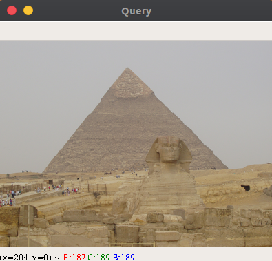
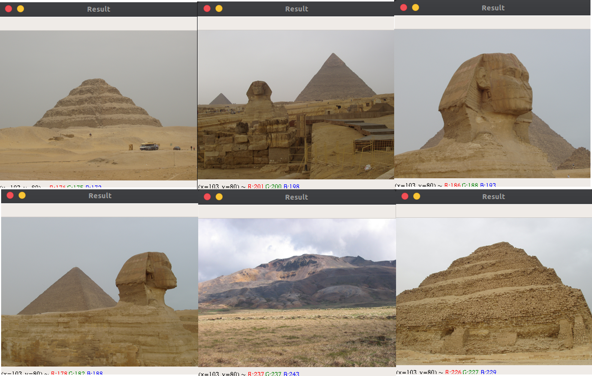

<h1 align="left">
    Image Search Engine
</h1>
  <p align="center">
 
 
 
  
 
 
 

 </p>

A simple image search engine built from the concept of Content-Based Image Retrieval (CBIR) systems.:sweat_smile:

## Features :gem:
   * Written in uncomplicated python :innocent:
   * Displays fairly all images related to the search query :droplet:
   * Works on Mac, Linux and Windows

## Installation :package:
1. Clone the repo
```bash
   $ git clone https://github.com/aibenStunner/image-search-engine.git
   $ cd image-search-engine
```
2. Install dependencies
```bash
   $ pip install -r requirements.txt
```

## Usage :computer:
* You'll need a dataset of images to work on. A sample dataset can be gotten from here <a href="http://lear.inrialpes.fr/people/jegou/data.php">INRIA Holidays Dataset.</a>

* To index the sample dataset, open up a shell and issue the following command:
```bash
    $ python index.py --dataset dataset --index index.csv
```

* To perform search on the dataset, issue the command:
```bash
    $ python search.py --index index.csv --query <path-to-image-search-query> --result-path dataset
```

## Demo :movie_camera:
   <p>Search query:</p>
   
   <p>Search results:</p>
   
